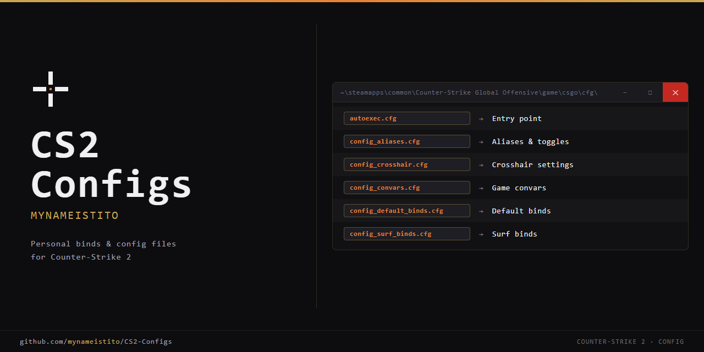

# Counter-Strike Configs — mynameistito

Personal config files for CS2, CSGO (legacy), and Counter-Strike: Source — managed via Git and deployed with a PowerShell script.

**Steam:** [steamcommunity.com/id/mynameistito](https://steamcommunity.com/id/mynameistito/)



---

## File Structure

```
counter-strike-configs/
├── cs2/               # Counter-Strike 2
├── csgo/              # Counter-Strike: Global Offensive (legacy) — coming soon
├── css/               # Counter-Strike: Source
├── assets/
└── deploy_configs.ps1 # Deployment script (symlink or copy)
```

See each folder's README for game-specific launch options, settings, and binds:

- [`cs2/README.md`](cs2/README.md)
- [`css/README.md`](css/README.md)
- [`csgo/README.md`](csgo/README.md)

---

## Installation

### 1. Clone

```bash
git clone https://github.com/mynameistito/CS2-Configs.git
```

### 2. Deploy

Run from any PowerShell window — no need to open as Administrator first:

```powershell
cd CS2-Configs
.\deploy_configs.ps1
```

If you hit an execution policy error:

```powershell
Set-ExecutionPolicy RemoteSigned -Scope CurrentUser
```

The script prompts for game and mode interactively, or skip prompts by passing flags directly:

```powershell
.\deploy_configs.ps1 -Game cs2 -Mode copy
.\deploy_configs.ps1 -Game all -Mode symlink
```

**`-Game`**

| Value | Description |
|---|---|
| `cs2` | Counter-Strike 2 |
| `csgo` | Counter-Strike: Global Offensive (legacy) |
| `css` | Counter-Strike: Source |
| `all` | All installed games |

**`-Mode`**

| Value | Description |
|---|---|
| `symlink` | Links cfg files directly into the repo. `git pull` applies instantly. Auto-elevates to Admin. |
| `copy` | Copies files into the game directory. No elevation needed. Re-run after each `git pull`. |

> [!CAUTION]
> **Symlink mode:** cfg files point directly into the cloned repo. If you move, rename, or delete the repo, all symlinks break. Keep the repo in a stable location.

**Target directories** are auto-detected from the Steam registry:

| Game | Path |
|---|---|
| CS2 | `<Steam>\steamapps\common\Counter-Strike Global Offensive\game\csgo\cfg\` |
| CSGO | `<Steam>\steamapps\common\Counter-Strike Global Offensive\csgo\cfg\` |
| CSS | `<Steam>\steamapps\common\Counter-Strike Source\cstrike\cfg\` |

---

## Updating

```bash
git pull
```

- **Symlink mode:** changes apply immediately — run `exec autoexec.cfg` in console.
- **Copy mode:** re-run `.\deploy_configs.ps1` after pulling.
